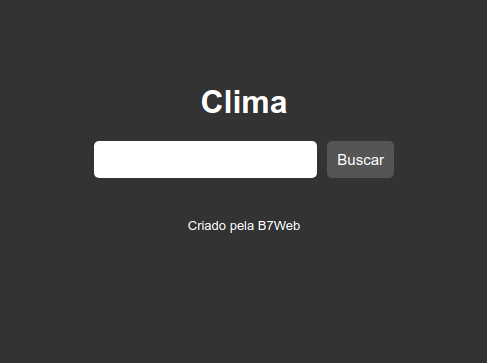
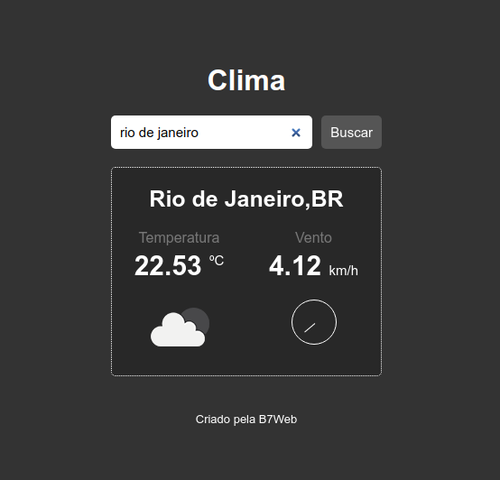
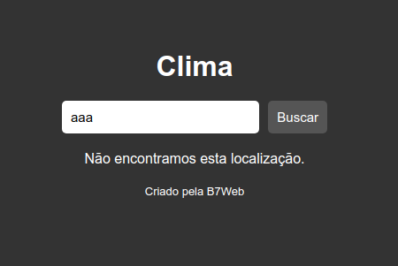

# Wheater API 🌦️☂️

## 👀 Como ficou ???

</img>
----------
</img>
----------
</img>
----------

## 🧑‍💻 Tecnologias usadas

O projeto foi desenvolvido com as seguintes tecnologias:
- [JavaScript](https://developer.mozilla.org/pt-BR/docs/Web/JavaScript)
- [HTML](https://www.w3schools.com/html/)
- [CSS](https://www.w3schools.com/css/)
- [API](https://openweathermap.org/api)

## ⌨️ Sobre o projeto

O projeto consome a api da [OpenWeather](https://openweathermap.org/api), que dá como está o tempo na cidade, no exato momento. Para consumir a API é necessário fazer um cadastro no site [OpenWeather](https://openweathermap.org/api). O mesmo foi desenvolvido durante o curso da [B7Web](https://b7web.com.br/fullstack/?ref=I24108426I) e com a ajuda do instrutor [Bonieky Lacerda](https://www.instagram.com/bonieky/).
